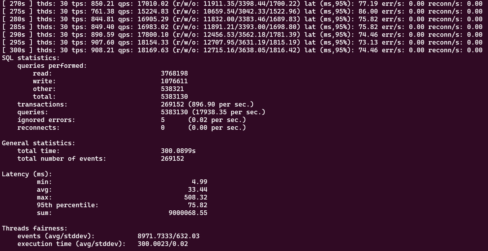

# TCP_proxy_server

## Задание
TCP прокси-сервер для СУБД Postgresql на C++ с возможностью логирования всех SQL запросов, проходящих через него.

## Детали
- Используются Berkley sockets (select/poll/epoll).
- Обрабатывает большое количество соединений без создания потока (thread) на каждое соединение.
- Записать в файл SQL запросы проходящие через прокси сервер.

## Описание
- Proxy - сервер прокси
- Logger - простой логгер в fd
- Logger_query - логгер с очередью для sql запросов


## Проблемы логгирования
1) Если вводим буфер, то мы должны понимать длину сообщений при считывании recv. Первичный обмен между клиентом и сервером не имеют кодов длины сообщения в начале строки, что ломает дальнейшую логику. Я пропускал первое сообщение, но при тестировании sysbench он присылает 2 сообщения без кодов. Ставить костыли на коды думаю не стоит.
2) Если считывать по Q то ловим ошибку, если ставим маленький буфер (около 10), то приходит ответы от сервера и иногда попадается буква Q на первом месте и мы интерпретируем ее как запрос (хотя она таковой не является). И находим длину которая равна 10^6 и логгирование ломается.
## Решения логиирования
1) Eсли убрать буффер и принять что длина максимальная равна 65 Кб то все работает, если пакет больше, то он не логгируется. Данное решение закоменчено в коде.
2) Считываем по символу Q, вероятность попадания текста запроса с первой Q минимальна.

## Тестирование
- мой test_serv
- sql запросы
```
Подключаемся напрямую:
psql "dbname=test_database user=test_user password=test_password"

Подключаемся через proxy_server
psql "host=localhost port=5000 dbname="test_database" user=test_user password=test_password sslmode=disable"
```
- sysbench
```
подготовка данных
sysbench \
  --db-driver=pgsql \
  --pgsql-host=localhost \
  --pgsql-port=5000 \
  --pgsql-user=test_user \
  --pgsql-password=test_password \
  --pgsql-db=test_database \
  --tables=20 \
  --table-size=1000000 \
  /usr/share/sysbench/oltp_read_write.lua prepare

тест read/write
sysbench \
  --db-driver=pgsql \
  --pgsql-host=localhost \
  --pgsql-port=5000 \
  --pgsql-user=test_user \
  --pgsql-password=test_password \
  --pgsql-db=test_database \
  --tables=20 \
  --table-size=1000000 \
  --threads=30 \
  --time=300 \
  --report-interval=5 \
  /usr/share/sysbench/oltp_read_write.lua run
```
```
тест read
sysbench \
  --db-driver=pgsql \
  --pgsql-host=localhost \
  --pgsql-port=5000 \
  --pgsql-user=test_user \
  --pgsql-password=test_password \
  --pgsql-db=test_database \
  --tables=20 \
  --table-size=1000000 \
  /usr/share/sysbench/oltp_read_only.lua prepare

sysbench \
  --db-driver=pgsql \
  --pgsql-host=localhost \
  --pgsql-port=5000 \
  --pgsql-user=test_user \
  --pgsql-password=test_password \
  --pgsql-db=test_database \
  --tables=20 \
  --table-size=1000000 \
  --threads=30 \
  --time=300 \
  --report-interval=5 \
  /usr/share/sysbench/oltp_read_only.lua run
```
```
очистка
sysbench \
  --db-driver=pgsql \
  --pgsql-host=localhost \
  --pgsql-port=5000 \
  --pgsql-user=test_user \
  --pgsql-password=test_password \
  --pgsql-db=test_database \
  --tables=20 \
  /usr/share/sysbench/oltp_read_write.lua cleanup
```

## Дополнительно`
### PostgreSQL и pgAdmin
- Необходимо отключить ssl шифрование в PostgreSQL
- Создаем пользователя для тестов
```
sudo -i -u postgres
psql

CREATE USER test_user WITH PASSWORD 'test_password';
CREATE DATABASE test_database WITH OWNER test_user;
GRANT ALL PRIVILEGES ON DATABASE test_database TO test_user;

\q
exit
```